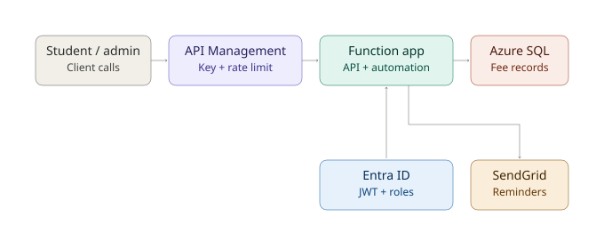

# Fee Management System

A cloud-native student fee management system built on Azure — automated fee reminders, a secure API for querying and updating fee records, and role-based access for students and administrators.

## Architecture



Students and admins call **API Management**, which enforces a subscription key and rate limiting before forwarding to the **Function App** — a Python Azure Functions app hosting both the REST API and the Durable Functions reminder pipeline, backed by **Azure SQL** for fee records. Admin-only operations are additionally authenticated via **Entra ID**, which issues a JWT carrying the caller's role (`Admin` or `Student`); the Function App validates this token and its role claim before allowing an update. The reminder pipeline runs on a daily timer, queries overdue students, and sends emails through **SendGrid**.

## Tasks implemented

| Task | Description |
|---|---|
| 1. Data Storage | Azure SQL Database — `Students` and `Administrators` tables, 20+ seeded records |
| 2. Automation | Durable Functions timer → orchestrator → fan-out email reminders via SendGrid, with retry policies |
| 3. Payment Status API | HTTP-triggered Function returning Paid/Partially Paid/Overdue, exposed via APIM with subscription-key auth and rate limiting |
| 4. Secure Admin Updates | `PUT /manage/fees/{studentId}`, protected by Entra ID JWT validation and `Admin` role check |
| 5. Scalability & Monitoring | Application Insights telemetry, Durable Functions `RetryOptions` for transient failure resilience |

**Note:** Task 2's automation was implemented with Durable Functions rather than Logic Apps — see `DEPLOYMENT_GUIDE.md` for the reasoning.

## Project structure

```
fee-management-system/
├── function_app.py            # All HTTP/timer/orchestrator/activity triggers
├── db.py                      # pyodbc connection handling
├── models.py                  # Student dataclass
├── repositories/
│   └── student_repository.py  # Raw SQL queries
├── services/
│   ├── fee_service.py         # Payment status logic
│   └── notification_service.py # SendGrid email sending
|── jwt_validator.py       # Entra ID JWT validation + role check
├── sql/
│   ├── schema.sql
│   └── seed_data.sql
├── requirements.txt
├── architecture.svg
├── DEPLOYMENT_GUIDE.md
└── README.md
```

## Full deployment steps

See [`DEPLOYMENT_GUIDE.md`](./DEPLOYMENT_GUIDE.md) for the complete, step-by-step provisioning and deployment guide, including all Azure CLI commands and verification requests used to test each task.